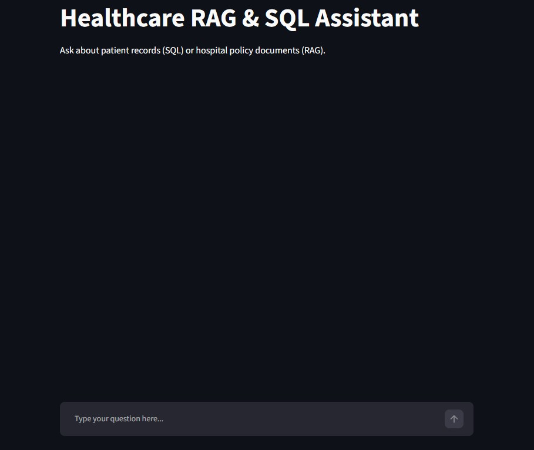
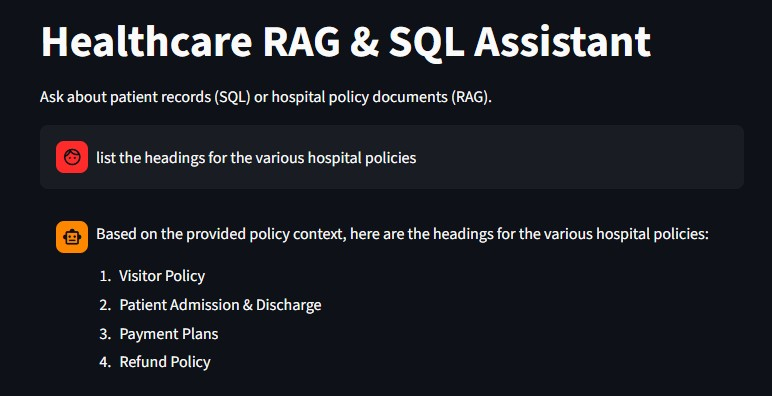
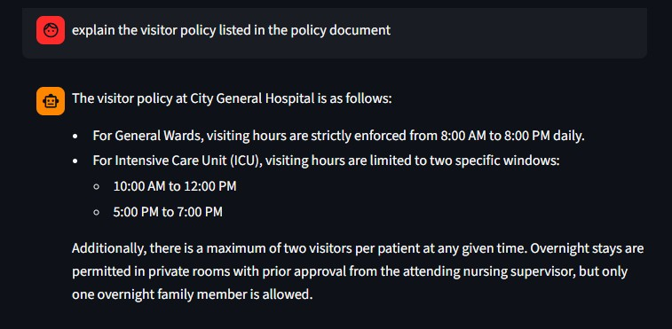
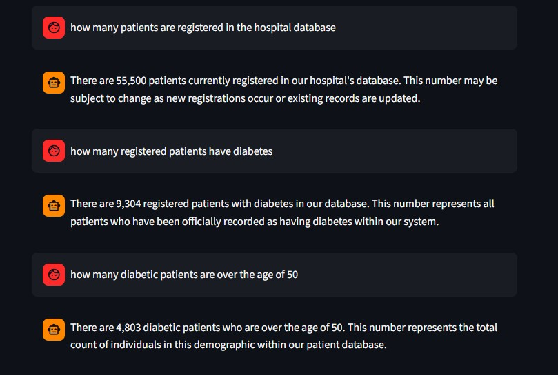
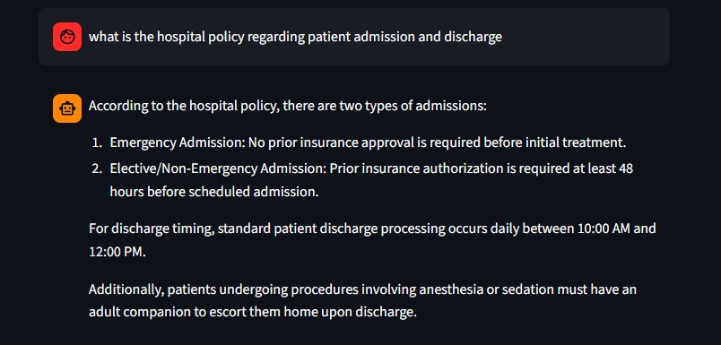
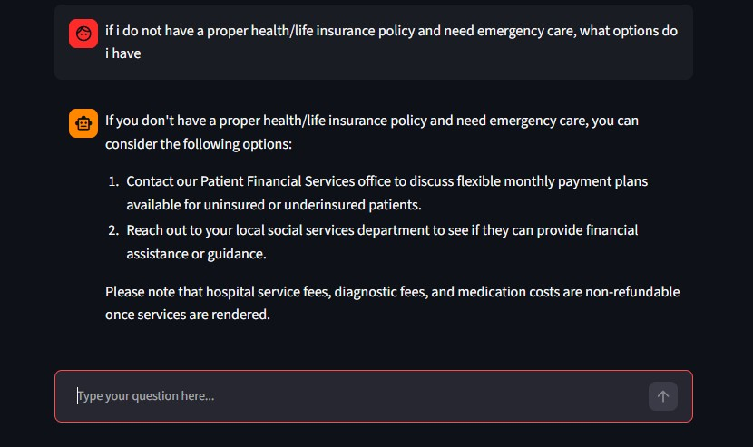
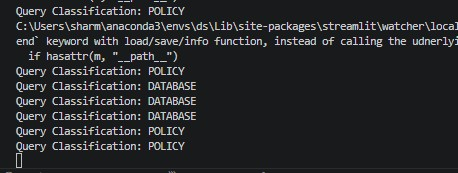

# Healthcare Assistant — Multi-Agent RAG & Text-to-SQL

An AI-powered multi-agent application that allows hospital staff to query patient records and hospital policy documents using plain English. An **Orchestrator Agent** classifies every incoming query and routes it to either the **NLP-to-SQL Agent**, which answers data-driven questions against a synthetic patient database, or the **RAG Agent**, which retrieves answers from synthetically generated hospital policy documents.

The project demonstrates a practical multi-agent architecture where structured and unstructured hospital knowledge becomes instantly accessible through a single conversational interface — fully offline, with no API rate limits.

---

## Architecture

```
User Query
    │
    ▼
┌─────────────────────┐
│  Orchestrator Agent │  ← classifies intent (DATABASE or POLICY)
└─────────────────────┘
        │               │
        ▼               ▼
┌──────────────┐  ┌────────────┐
│ NLP-to-SQL   │  │  RAG Agent │
│    Agent     │  │            │
└──────────────┘  └────────────┘
        │               │
        ▼               ▼
  SQLite Patient    ChromaDB +
   Database         Policy PDFs
```

---

## Features

- **Query Routing** — Orchestrator Agent classifies every query as `DATABASE` or `POLICY` and routes accordingly.
- **NLP-to-SQL Pipeline** — Converts natural language questions into SQLite queries to retrieve structured patient statistics, records, and demographic data.
- **PDF-Based RAG Pipeline** — Parses hospital policy PDFs via `PyPDFDirectoryLoader`, generates embeddings with HuggingFace `all-MiniLM-L6-v2`, and performs similarity search via ChromaDB.
- **Fully Offline Execution** — Uses local Llama models (`llama3.2`) via Ollama. No API keys, no rate limit errors, full data privacy.
- **Interactive Web Interface** — Custom-styled Streamlit chat UI with session state and query history.

---

## Screenshots

**The Main idle UI**


**RAG Query — policy document retrieval**


**RAG Query - retreive specific policy**


**SQL Query - retrieve specific details regarding the db**


**RAG Query - retreive details regarding a policy**


**RAG Query - user specific query**
  

**The terminal showing orchastrator splitting the queryies into categories**  


## Project Structure

```
healthcare_rag/
├── data/
│   ├── healthcare.db         # SQLite database with synthetic patient records
│   ├── policies/             # Hospital policy PDF documents
│   └── chroma_db/            # Persisted ChromaDB vector index
├── src/
│   ├── data_loader.py        # Populates SQLite from CSV
│   ├── rag_setup.py          # Parses PDFs and builds ChromaDB index
│   ├── sql_agent.py          # NLP-to-SQL execution pipeline
│   ├── rag_agent.py          # Document retrieval and RAG response
│   └── orchestrator.py       # Intent classification and agent routing
├── app.py                    # Streamlit web UI entry point
├── requirements.txt
└── README.md
```

---

## Prerequisites

- **Python 3.10+**
- **Ollama** — download and install from [ollama.com](https://ollama.com/)
- **llama3.2** model pulled locally:

```bash
ollama pull llama3.2
```

---

## Installation

**1. Clone the repository**

```bash
git clone https://github.com/Sxham04/healthcare_rag.git
cd healthcare_rag
```

**2. Create and activate a virtual environment**

```bash
python -m venv env

# Windows
.\env\Scripts\activate

# macOS / Linux
source env/bin/activate
```

**3. Install dependencies**

```bash
pip install -r requirements.txt
```

**4. Initialize the databases**

Place your patient CSV in the expected path and your hospital policy PDF at `data/policies/hospital_policies.pdf`, then run:

```bash
python src/data_loader.py   # builds healthcare.db
python src/rag_setup.py     # parses PDFs and builds chroma_db
```

---

## Running the App

```bash
streamlit run app.py
```

---

## Example Queries

| Type | Query |
|---|---|
| Database (SQL) | "How many patients over age 30 are in the database?" |
| Database (SQL) | "How many unique doctors are registered?" |
| Policy (RAG) | "What are the visiting hours for the hospital?" |
| Policy (RAG) | "What is the hospital policy on insurance?" |

---

## Tech Stack

| Component | Technology |
|---|---|
| LLM (local) | Llama 3.2 via Ollama |
| Embeddings | `all-MiniLM-L6-v2` (HuggingFace) |
| Vector store | ChromaDB |
| Structured DB | SQLite |
| PDF parsing | PyPDFDirectoryLoader (LangChain) |
| Web UI | Streamlit |

---

## Built as part of the Celebal Excellence Internship (CEI)
